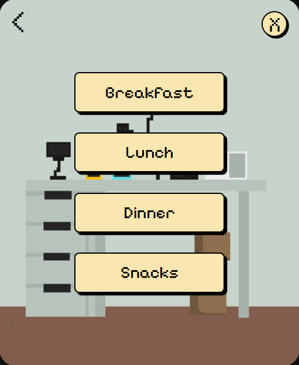

# 👨🏻🍽️ food-log-widget

A minimalist, pixel-art desktop food logging widget built with **Tauri** and **HTML/CSS/JS**.

Ethan clicks. Ethan logs. No distractions.

---

## 🍳 Features

- Log breakfast, lunch, dinner, or snacks with one click
- Type what you ate and check off common food triggers (e.g., dairy, sugar)
- Track how you felt afterward with symptom checklists (e.g., fatigue, brain fog)
- Export each entry as a **timestamped CSV** with all the data
- Works fully offline — lightweight and private

## 💡 Technologies Used
- Tauri (for native desktop shell)
- Vanilla HTML, CSS, and JS
- Pixel fonts & character sprite art
- File download via broswer Blob API

## ✨ About
This widget was made to help Ethan develop food awareness and symptom tracking in a super low-effort way. Hopefully, this helps Ethan get to the bottom of his gut issues.

## 📸 Screenshots




## License
MIT License

---


---
## 📦 Installation & Usage

### 🛠️ Requirements
- [Node.js](https://nodejs.org/)
- [Tauri CLI](https://tauri.app/v2/guides/getting-started/prerequisites/) (`npm install -g @tauri-apps/cli`)

### ▶️ Run locally

```bash
git clone https://github.com/teomi16/food-log-widget.git
cd food-log-widget
npm install
npm run tauri dev
